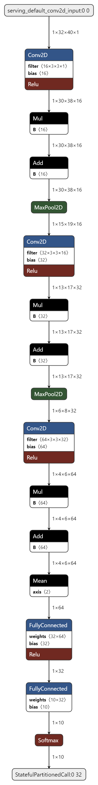

# ESC_STM32F411RE

CNN-based ESC model on the STM32F411RE using UrbanSound8K.

## Overview

This project implements a Convolutional Neural Network (CNN)-based Environmental Sound Classification (ESC) model on the STM32F411RE ARM. The model is trained using the UrbanSound8K dataset, which contains labeled sound from urban environments. The goal is to classify environmental sounds in real-time on a resource-constrained embedded system.

## Features

- **Pre-trained CNN Model**: A lightweight CNN model optimized for the STM32F411RE.
- **Real-Time Inference**: Classifies audio input in real-time.
- **Dataset**: Utilizes the UrbanSound8K dataset for training and evaluation.
- **Embedded Deployment**: Model quantized and deployed on STM32F411RE using STM32Cube.AI.

## Requirements

- STM32F411RE Nucleo Board
- STM32CubeIDE
- STM32Cube.AI
- Python 3.x (for training and preprocessing)
- TensorFlow/Keras (for model development)
- UrbanSound8K dataset

## Project Structure

```
ESC_STM32F411RE/
├── Dataset/
│   ├── UrbanSound8K/
│   └── Preprocessed/
├── Model/
│   ├── train_model.py
│   ├── model.h5
│   └── quantized_model.tflite
├── STM32/
│   ├── Core/
│   ├── Drivers/
│   └── Inc/
├── README.md
└── LICENSE
```

## Getting Started

1. **Dataset Preparation, Model Training and Model Quantization**:
    - Download the UrbanSound8K dataset from [UrbanSound8K](https://urbansounddataset.weebly.com/urbansound8k.html).
    - First, extract features from the audio files using `extract_features.py` or `main.py`.
    - Then, run `model/prepare_dataset.py` to prepare the features.
    - The dataset will be split into training and validation sets.
    - Now, run `train_model.py` or `train_urbansound.py` to train the model.
    - Then, `qunatize_model.py` will quantize the model for STM32 deployment.
    - Run all evaluation scripts to check the model performance.

2. **STM32 Deployment**:
    - Import the quantized model into STM32Cube.AI.
    - Generate the C code and integrate it into the STM32 project.

3. **Build and Flash**:
    - Use STM32CubeIDE to build the project.
    - Flash the firmware onto the STM32F411RE board.

## Usage

- Connect a microphone to the STM32F411RE board (check pins used in the STM project).
- Run the firmware to classify real-time audio input.
- The classification results will be displayed via UART.

## Model Architecture



## License

This project is licensed under the MIT License.

## Acknowledgments

- UrbanSound8K dataset authors for providing the dataset.
- STM32Cube.AI for enabling embedded AI deployment.
- TensorFlow/Keras for model development tools.
